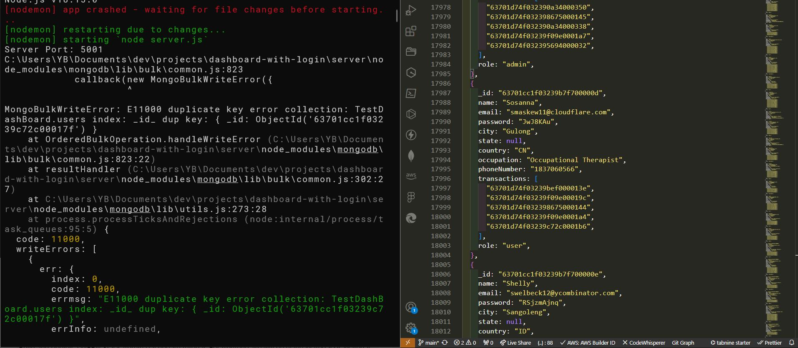

# 01_mongoBulkWriteError_E11000_duplicate_key_error_collection

## 1. 원인

`server/data`에서 mock 데이터를 넣을 때 `const dataUser`에서 `{ _id: '63701d74f03239bef0000155', }`에서 문제가 발생했다. 그 이유는 `_id`는 mongoDB 데이터에서 자동으로 설정해 주는데, mock 데이터에서 넣어버렸기 때문이다. 그렇기 때문에 duplicate(중복)이 발생한 것이다.

## 2. 해결

`const dataUser`에서 `{_id:....}` 이 부분을 삭제하고 `model/User.js` schema에 있는 데이터만 객체로 넣어야 한다.
